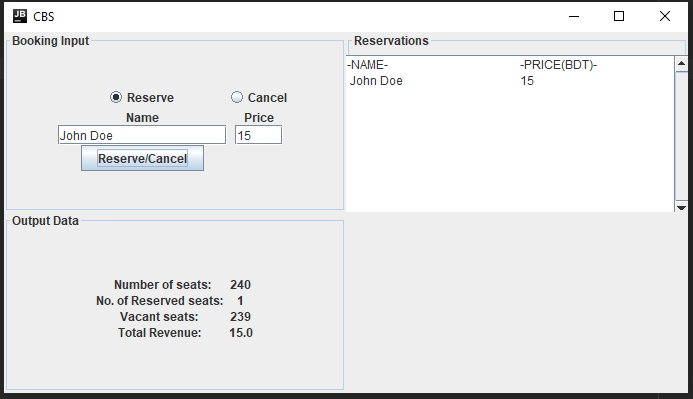

# Reservation-system
This repo contains the solution to an assignment that was given in the course CSE-215

<h4> Description:</h4>

CBS is a GUI based Cinema seat reservation system that facilitates the
reservation of tickets for movie theater. The user of this application is a cinema staff or a Cashier.
The Cashier registers the name of the customer and the price for the seat. The program assigns the first vacant
seat number counted from the seat at the most rear part of the auditorium, i.e. the last chair.

  

 
